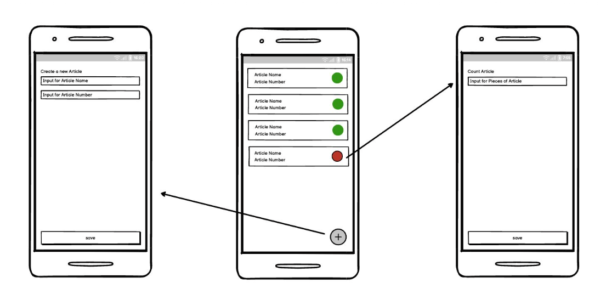
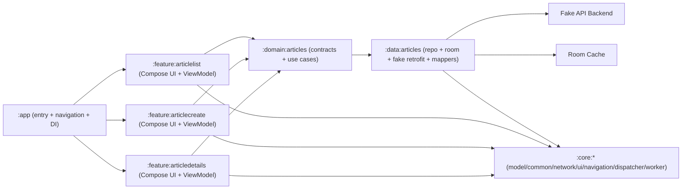

# Documentor App

Android app for managing in-store articles with a modular clean-layered setup, cache-first data flow, mocked backend, and benchmark/CI support.

## Preview

## Architecture Diagram

## Modules and Submodules

### App entry
- `:app`
  - Android application module.
  - Hosts top-level navigation and app DI bindings.

### Feature layer
- `:feature:articlelist`
  - Main screen showing article list with number/name and status indicator.
  - Cursor-based list loading from repository use case.

- `:feature:articlecreate`
  - Create article screen (name + number input).
  - Input validation and save intent handling.

- `:feature:articledetails`
  - Count article screen (pieces input for available article).
  - Update intent handling and validation.

### Domain layer
- `:domain:articles`
  - Repository contract and use cases (`get list`, `get details`, `create`, `update`).

### Data layer
- `:data:articles`
  - `ArticlesRepositoryImpl` implementation.
  - Remote datasource via Retrofit + fake interceptor/backend.
  - Local datasource via Room DAO/entities.
  - Cache-first reads with Room source-of-truth behavior.
  - Cursor-based pagination.
  - Retry policy for retryable server/network failures.

### Core shared modules
- `:core:model` shared models and result wrappers.
- `:core:common` error mapping and retry policies.
- `:core:network` network-related abstractions.
- `:core:dispatcher` coroutine dispatcher qualifiers/modules.
- `:core:navigation` shared destination contracts.
- `:core:ui` shared theme/colors/typography.
- `:core:worker` background sync module (WorkManager + startup initializers + sync bootstrap).

### Performance/benchmarking
- `:benchmark`
  - Macrobenchmark module (`com.android.test`) targeting `:app`.
  - Startup/navigation/list-scroll/edit-flow benchmark scenarios.

### Build infrastructure
- `build-logic`
  - Convention plugins for centralized Gradle configuration.

## Architecture

The project follows modular Clean Architecture with clear boundaries:

- Presentation in `feature` modules (Compose + ViewModel + intent contract).
- Use cases and contracts in `domain`.
- Implementations in `data` (API + DB + mapping + repository logic).
- Shared capabilities in `core` modules.

At screen level, state flow is intent-driven:
- UI emits intents/actions.
- ViewModel coordinates use cases.
- Repository emits `Flow<ResultState<...>>`.
- UI renders derived immutable UI state.

## Cache-First Data Flow

- Reads prioritize local Room cache.
- On cache miss, repository fetches fake backend via Retrofit and upserts Room.
- Single article and paged list both follow cache-first behavior.
- Article create/update writes remote (fake backend) and then updates local cache.

## Device Synchronization (Mocked Production Pattern)

The optional synchronization requirement is implemented with a production-style pattern, fully mocked:

1. Fake backend emits store-change invalidations when articles are created/updated.
2. `:core:worker` observes invalidations and enqueues unique one-time sync work.
3. Sync worker pulls cursor pages from backend and upserts Room.
4. A low-frequency periodic fallback sync is scheduled for missed push events.

Notes:
- Push is used as an invalidation trigger, not source of truth.
- Reliability comes from WorkManager + pull sync + retry policy.

## Tools and Tech Stack

- Kotlin, Coroutines, Flow
- Jetpack Compose (Material 3)
- Hilt + KSP
- Retrofit + OkHttp (fake interceptor backend)
- Room
- WorkManager + AndroidX Startup
- Macrobenchmark + UIAutomator
- Gradle Version Catalog + convention plugins (`build-logic`)
- GitHub Actions CI (lint + unit tests)

## Testing

- Domain use case unit tests.
- Data module tests:
  - DAO/Room tests
  - repository tests
  - fake backend tests
  - data-domain integration tests
- Feature layer tests:
  - ViewModel tests
  - Compose UI tests for user actions
- Worker/sync tests in `:core:worker`.

## Useful Commands

- Unit tests (all modules):
  - `./gradlew test`

- Lint + debug unit tests:
  - `./gradlew lintDebug testDebugUnitTest`

- Feature UI tests:
  - `./gradlew :feature:articlelist:connectedDebugAndroidTest :feature:articlecreate:connectedDebugAndroidTest :feature:articledetails:connectedDebugAndroidTest`

- Macrobenchmark:
  - `./gradlew :benchmark:connectedDebugAndroidTest`

## CI

GitHub Actions workflow: `.github/workflows/ci.yml`

Runs on every push/PR:
- `./gradlew lintDebug --no-daemon`
- `./gradlew testDebugUnitTest --no-daemon`

## Challenge Scope Coverage

- API layer built on fake data.
- Cursor-based pagination.
- Fetch list + fetch single article.
- Create/edit article flows.
- Modularized screens and data/domain/core modules.
- Cache-first Room setup.
- Result/error wrappers and flow-based repository.
- Retry policy and application error mapping.
- Presentation/data/domain tests.
- Macrobenchmark scenarios.
- CI for lint and tests.

